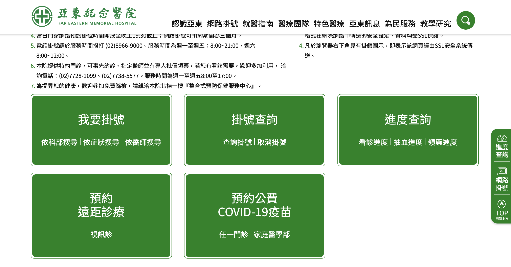
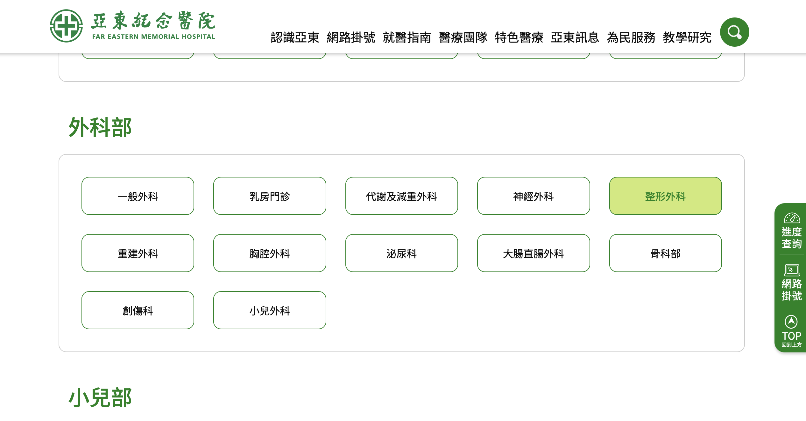
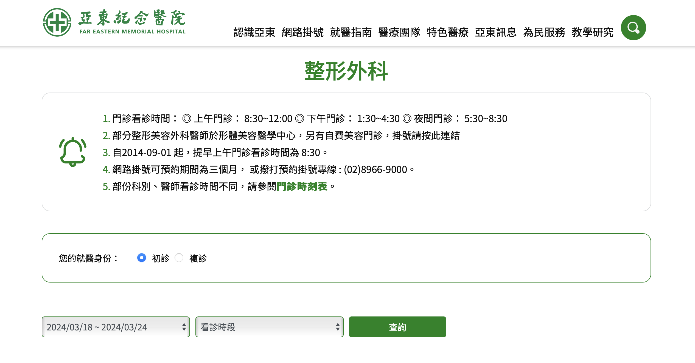
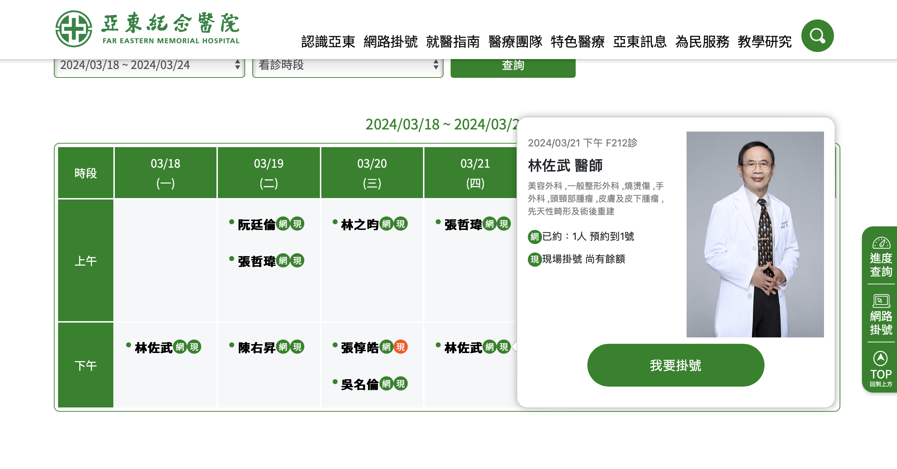
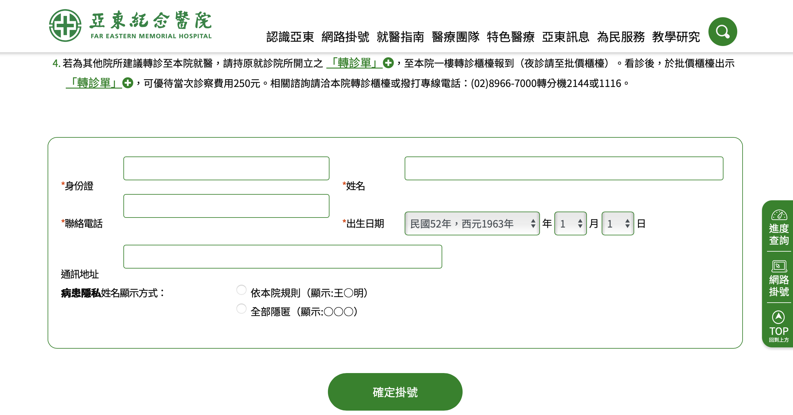
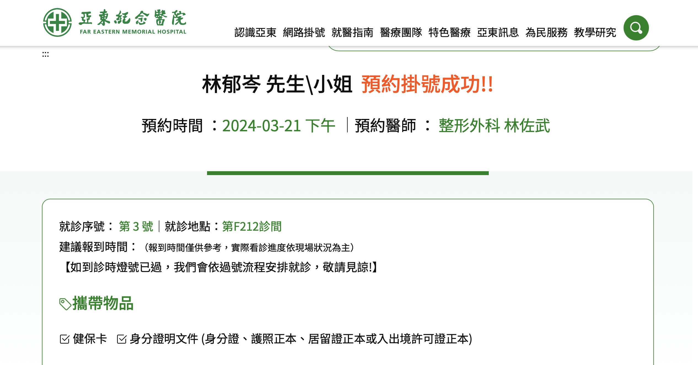

# 第1次作業-作業-HW1
>
>學號：111111117
> 
>姓名：林郁岑
> 
>作業撰寫時間：20 mins
> 
>最後撰寫文件日期：2024/03/11
>

本份文件包含以下主題：(至少需下面兩項，若是有多者可以自行新增)
- [x] 說明內容
- [x] 個人認為完成作業須具備觀念

## 說明程式與內容

git branch：新增分支

git checkout 分支名稱：切換分支

git merge 分支名稱：合併分支

git add：添加檔案

git commit：讓暫存區的檔案提交到儲存庫

git push：將檔案推上去到github

-----------------------------------------

註：先到亞東醫院官網掛號區

註：選擇要掛號的科別

註：選擇看診時間跟時段

註：選擇要看診的醫生

註：填寫掛號基本資訊

註：再次確認後就可掛號

註：預約掛號成功

## 個人認為完成作業須具備觀念

這次作業所用到的程式碼是用Git版本控制系統來進行作業的基本操作，包括新增分支、切換分支、合併分支、添加檔案、提交檔案到儲存庫、以及將檔案推送到GitHub等步驟。
